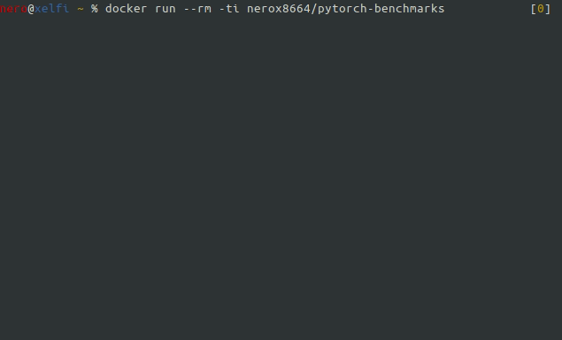

# pytorch-benchmarks


[](https://opensource.org/licenses/MIT)
[](https://github.com/nerox8664/pytorch2keras)

A set of PyTorch benchmarks.


## Usage

```
nvidia-docker run --rm -ti nerox8664/pytorch-benchmarks
```

If you want run in a loop:

nvidia-docker run --rm -ti --entrypoint "/root/loop.sh" nerox8664/pytorch-benchmarks




## License
This software is covered by MIT License.
